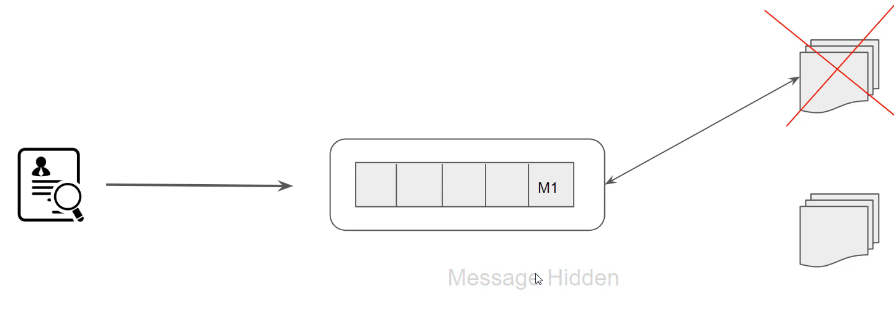
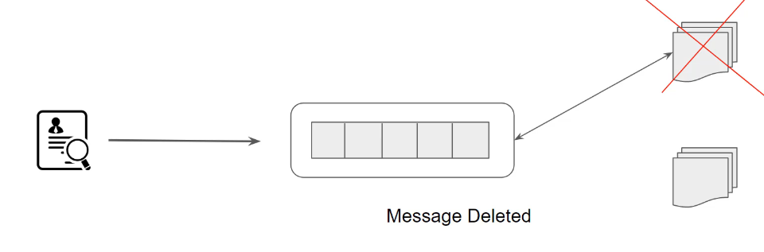

# SQS-Visibility Timeout

## Challenge

When consumer receiving a message from the queue , the message still remains in the queue and is not deleted.

What is the challenge if the message is deleted?

## Visibility Timeout

When consumer receives a message from the queue, the message still remains in the queue and is not deleted. However it remains in hidden state for specific interval and can be
deleted by consumer once it has completed processing.

