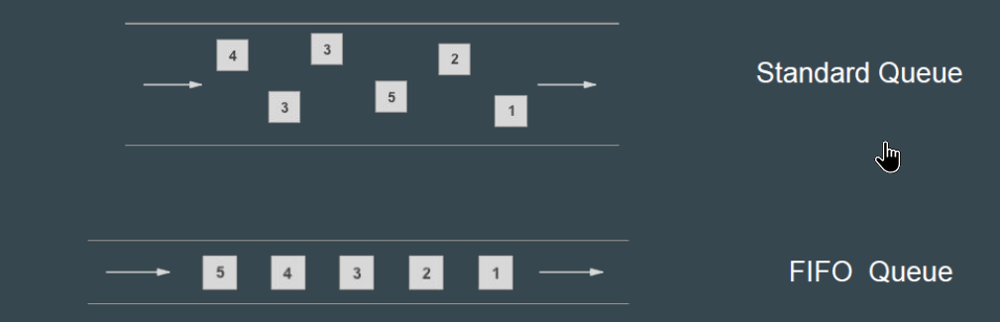

# Amazon SQS queue types

## Types of SQS Queue

There are two primary types of SQS queues.

## Message Ordering

| Queue Type     | Message Ordering |
|----------------|------------------|
| Standard Queue | Best-effort ordering; messages may be delivered out of order. |
| FIFO Queue     | First-In-First-Out; message order is strictly preserved. |

## Difference

| Characteristic | Standard Queue | FIFO Queue |
|----------------|----------------|------------|
| Throughput | Standard queues support a nearly unlimited number of API calls per second, per API action (`SendMessage`, `ReceiveMessage`, or `DeleteMessage`). | FIFO queues support up to 300 API calls per second, per API method (`SendMessage`, `ReceiveMessage`, or `DeleteMessage`). |
| Delivery | A message is delivered at least once, but occasionally more than one copy of a message is delivered. | A message is delivered once and remains available until a consumer processes and deletes it. Duplicates aren't introduced into the queue. |
| Ordering | Messages can be out of order. | Messages are delivered in order. |
